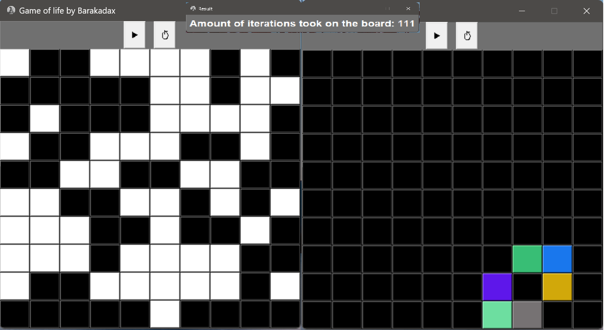

# Game of life

Random board with cells dead (black) and alive (white) 
Iterates row on column. 
## Roles: 
<li> If a cell is dead and has exactly three neighbors that are alive, it turns alive. 
<li> If a cell is alive and has either two or three neighbors that are alive, it remains alive. 
<li> If a cell is alive and has fewer than two neighbors that are alive, it dies. 
<li> If a cell is alive and has more than three neighbors that are alive, it dies. 
 
